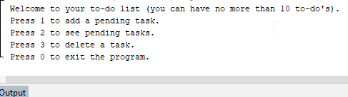

Java-Task-List
================
My first proyect made in Java: a task list that allows you to keep track of your pending tasks.

.

## Project Structure:

The project includes several files and folders, mainly generated by NetBeans to manage the project. The main file of interest is a Java file containing the application logic and user interface.

## Objective:

The main objective of this project is to provide users with a simple tool to manage their daily tasks efficiently and keep a clear record of pending tasks.

## Description

"Java Task Scheduler" is a programming project developed in the NetBeans environment. This application provides users with a simple and easy to use interface to manage their daily tasks. The following are the key features of the application:

### Features: 

#### Interactive Menu 

The application features an interactive menu that continuously repeats as long as the user desires. The menu offers several options, such as adding a task, viewing pending tasks, deleting a task or exiting the program.

#### Task Limitation

To keep task management simple and effective, the application limits the maximum number of tasks to 10. If a user attempts to add a task beyond this limit, the user will have to choose which task he/she wants to overwrite..

#### Add Tasks

Users can add new tasks by specifying a description and other relevant details.

#### View Pending Tasks

The application allows users to view a list of all pending tasks, which helps them keep track of their responsibilities.

#### Delete Tasks

Users can remove specific tasks from the list when they are no longer needed.

#### End Program

At any time, users can choose to end the application run and exit the application.
